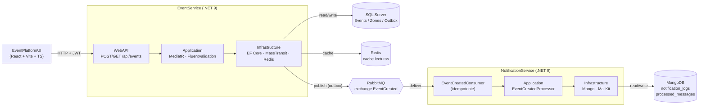
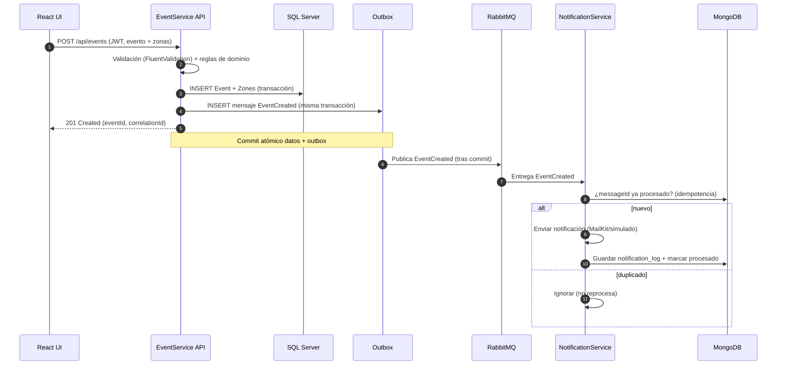

# Arquitectura — Plataforma de Eventos Online

> Reto Técnico (Líder Técnico) — Caso práctico. Diseño de arquitectura basada en
> microservicios y eventos, con un MVP funcional (EventService + NotificationService + UI).

## 1. Visión general

La plataforma sigue un estilo **microservicios + event-driven** con un **broker de
mensajería (RabbitMQ)**. Cada microservicio es dueño de su propia base de datos
(*database-per-service*) y se comunica de forma **síncrona (HTTP/REST)** para consultas y
**asíncrona (eventos)** para propagar cambios de estado.

El MVP implementa dos microservicios con **Clean Architecture + DDD**:

| Microservicio        | Responsabilidad                                   | Persistencia | Mensajería            |
|----------------------|---------------------------------------------------|--------------|-----------------------|
| **EventService**     | Registrar/publicar eventos y zonas                | SQL Server   | Publica `EventCreated`|
| **NotificationService** | Notificar (email/SMS/push) ante eventos        | MongoDB      | Consume `EventCreated`|

Servicios de apoyo: **Redis** (cache de lecturas), **RabbitMQ** (broker), y un
**frontend React** (pantalla "Registrar Evento").

## 2. Diagrama de componentes (MVP)



## 3. Listado de microservicios

- **EventService** — dominio de eventos. SQL (consistencia transaccional, relaciones
  Event→Zone). Publica integración `EventCreated`.
- **NotificationService** — dominio de notificaciones. NoSQL (documentos de auditoría,
  alta escritura, esquema flexible). Consume `EventCreated` de forma idempotente.

> Evolución (no en el MVP, contemplados en el diseño): `SearchService`
> (Elasticsearch/OpenSearch), `TicketingService` (alta concurrencia, anti-sobreventa con
> Redis + reservas), `PaymentService` (PSP), `IdentityService` (OIDC/OAuth2),
> `CheckInService` (validación QR, modo offline).

## 4. Flujo: crear evento (HTTP síncrono + evento asíncrono)



**Cache de lecturas** (`GET /api/events`): se sirve desde Redis si existe; en *cache miss*
se consulta SQL y se repuebla. La escritura de un evento invalida la clave de la lista.

## 5. Contrato del mensaje (obligatorio)

```json
{
  "messageId": "uuid",
  "eventId": "uuid",
  "name": "string",
  "occurredAt": "ISO-8601",
  "correlationId": "uuid",
  "version": 1
}
```

- **Idempotencia**: `NotificationService` reserva `messageId` en MongoDB (`_id` único). Un
  segundo mensaje con el mismo `messageId` es ignorado.
- **Trazabilidad**: `correlationId` viaja en el header del mensaje y en los logs.

## 6. Patrones de resiliencia y alta concurrencia

| Patrón | Dónde | Propósito |
|--------|-------|-----------|
| **Transactional Outbox** (MassTransit + EF) | EventService | No perder eventos: el mensaje se persiste en la misma transacción y se entrega tras el commit. |
| **Idempotent Consumer** | NotificationService | Evitar procesar dos veces el mismo `messageId`. |
| **Retry exponencial** (MassTransit) | Ambos | Tolerar fallas transitorias del broker/consumidor. |
| **EF `EnableRetryOnFailure`** | EventService | Reintentos ante fallas transitorias de SQL (deadlocks, timeouts). |
| **Cache-aside fail-open** (Redis) | EventService | Si Redis cae, la API sigue respondiendo desde SQL. |
| **Optimistic concurrency** (`rowversion`) | EventService | Base para control anti-sobreventa en evolución. |
| **Health checks** | Ambos | Readiness/liveness para orquestadores. |

Alta concurrencia (preventa/lanzamientos): lecturas servidas por **Redis**, escrituras
desacopladas vía **broker**, y servicios **stateless** escalables horizontalmente
(ECS Fargate / réplicas).

## 7. Seguridad (JWT, roles, boundaries)

- **AuthN/AuthZ**: JWT *Bearer* (compatible OIDC/OAuth 2.0). En el MVP el token se firma con
  clave simétrica; en AWS se sustituye por **Cognito**/IdP con JWKS.
- **Roles**: `POST /api/events` exige rol **Admin**; las lecturas son públicas.
- **Boundaries**: cada servicio expone solo su API; la comunicación entre servicios es por
  **eventos** (no acceso directo a la BD ajena). Secrets fuera del código (env / Secrets Manager).
- **CORS**: orígenes permitidos configurables por entorno.

Ver el mapeo a servicios AWS en [`aws-deployment.md`](./aws-deployment.md).
