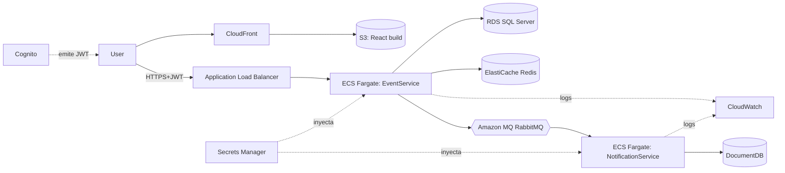

# Despliegue en AWS — servicios y llaves requeridas

> **Opcional.** El reto solo exige *considerar* una arquitectura AWS o híbrida a nivel de
> **diseño**; no requiere desplegar el MVP. Esta guía es para quien quiera dar ese paso extra.

Esta guía traduce la infraestructura local a servicios AWS y lista **exactamente qué debes
crear y qué llaves/valores entregarme** para conectar la solución. Todo el código ya lee su
configuración por variables de entorno, así que no hay que tocar código: solo proveer valores.

## 1. Mapeo local → AWS

| Componente local | Servicio AWS recomendado | Alternativa / Free Tier |
|------------------|--------------------------|--------------------------|
| SQL Server (EventService) | **Amazon RDS for SQL Server** | RDS `db.t3.micro` (Free Tier) o PostgreSQL |
| MongoDB (NotificationService) | **Amazon DocumentDB** (compatible Mongo) | **DynamoDB** (rediseño) o Mongo Atlas |
| RabbitMQ (broker) | **Amazon MQ for RabbitMQ** | **SQS + SNS** (rediseño del transporte) |
| Redis (cache) | **Amazon ElastiCache for Redis** | Redis en contenedor |
| EventService API | **ECS Fargate** (contenedor) | App Runner / EKS |
| NotificationService API | **ECS Fargate** (contenedor) | AWS Lambda (event-driven) |
| Frontend React | **S3 + CloudFront** | Amplify Hosting |
| Imágenes Docker | **Amazon ECR** | — |
| JWT / OIDC | **Amazon Cognito** | IdP propio |
| Secretos | **AWS Secrets Manager** / SSM Parameter Store | — |
| Observabilidad | **CloudWatch Logs/Metrics** | — |

## 2. Topología objetivo

## 3. Qué debes crear en AWS (orden sugerido)

1. **ECR** — 3 repos: `eventservice-api`, `notificationservice-api`, (opcional) UI.
2. **RDS SQL Server** (Free Tier `db.t3.micro`) — anota endpoint, puerto, usuario, contraseña.
3. **DocumentDB** (o cluster Mongo) — anota connection string.
4. **Amazon MQ (RabbitMQ)** — anota host AMQPS, usuario, contraseña.
5. **ElastiCache Redis** — anota endpoint:puerto.
6. **Cognito User Pool** — anota Issuer (Authority) y Audience (App client id).
7. **Secrets Manager** — guarda las credenciales anteriores.
8. **ECS Fargate** (cluster + servicios) detrás de un **ALB**; **S3+CloudFront** para la UI.
